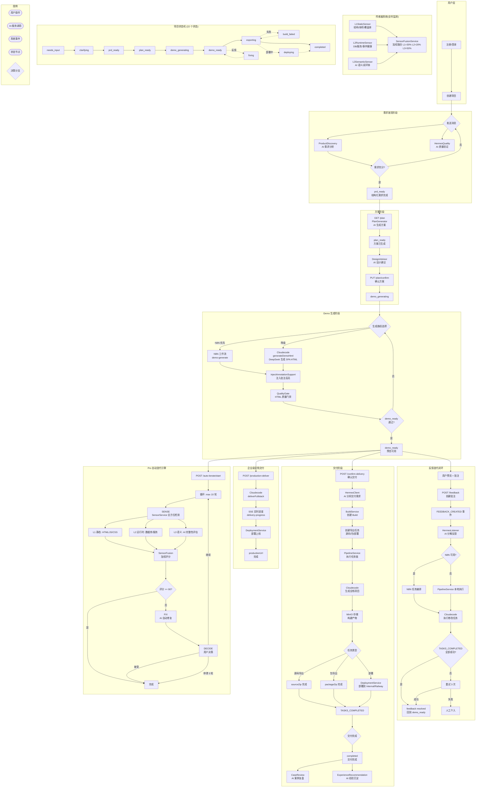

# 业务流程总图



## 核心业务路径

### 1. 主链路（用户 → 交付）
```
注册 → 创建项目 → 聊天澄清需求 → PRD 确认 → 方案生成 → Demo 生成 → 预览批注 → 交付完成
```

### 2. 反馈迭代闭环
```
预览批注 → AI 分解 → N8N/Pipeline 执行 → 自动验证 → Demo 更新
```

### 3. Pro 自动迭代
```
传感器检测 → AI 修复 → 用户决策 → 循环直到 ≥90 分
```

## 事件驱动架构

| 事件 | 触发点 | 消费者 | 作用 |
|------|--------|--------|------|
| `feedback.created` | 用户提交批注 | HermesListener | 自动分解反馈为任务 |
| `tasks.created` | 任务分配 | PipelineService | 执行修改/导出/部署 |
| `tasks.completed` | 任务完成 | DeliveryService | 推进状态机 |
| `delivery.export.requested` | 导出请求 | DeliveryOrchestrator | 处理各类导出 |
| `task.failed` | 任务失败 | FeedbackService | 标记重试状态 |

## AI 服务依赖关系

```
DeepSeek API
├── ProductDiscovery      → 需求澄清
├── HermesQuality         → PRD 质量验证
├── PlanGenerator         → 方案生成
├── DesignAdvisor          → 设计建议
├── HermesClient          → 反馈分解、交付分析
├── CloudecodeClient      → Demo 生成、代码修改
├── HtmlValidator         → 结构验证
├── CaseReview            → 案例复盘
├── ExperienceRecommendation → 经验沉淀
└── IterativeOptimizer    → 自动优化
```
