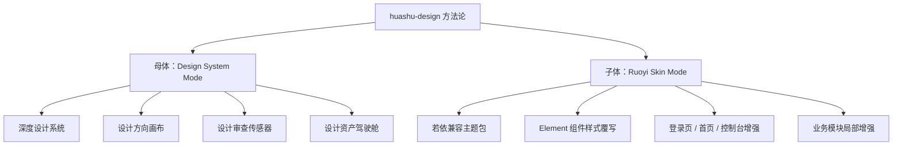
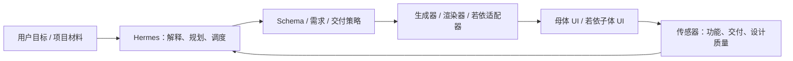
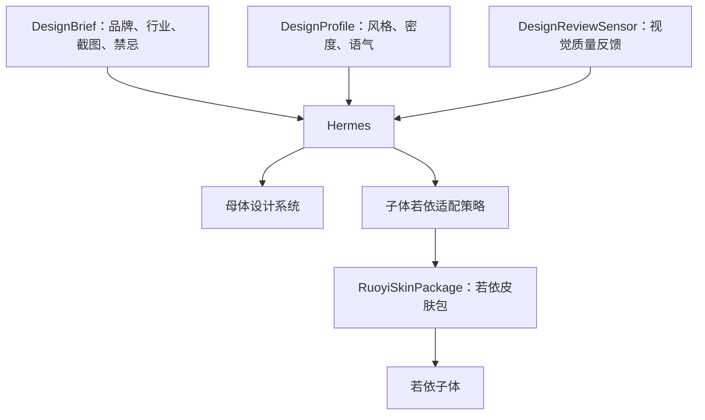
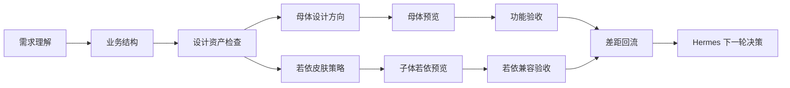
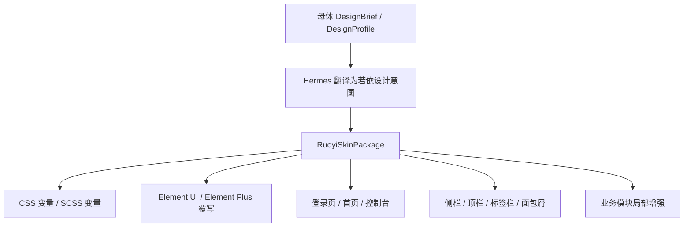
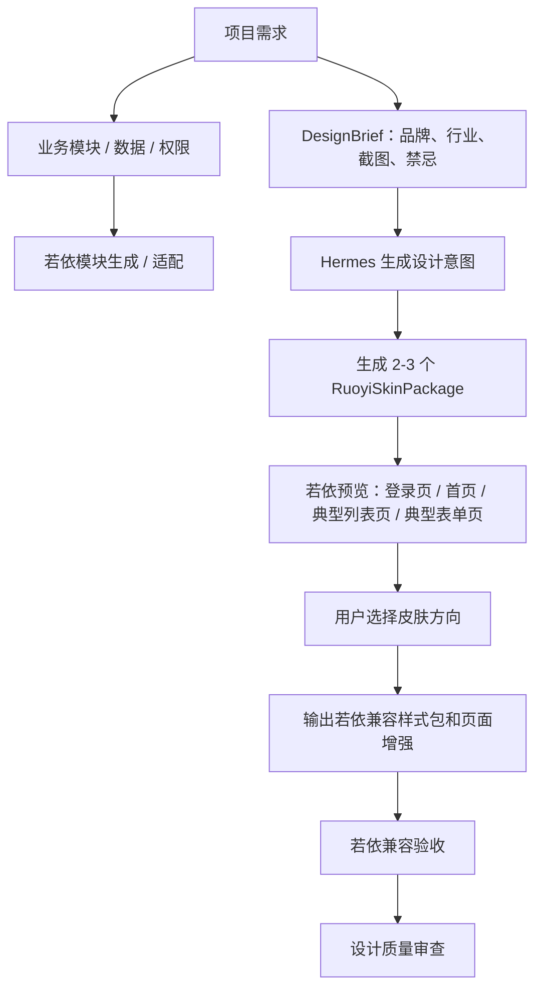
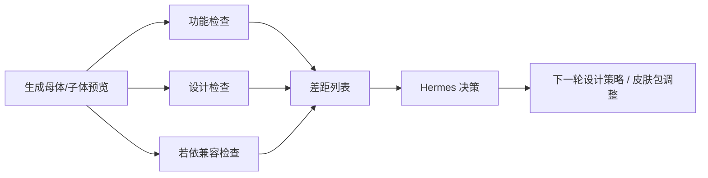

# huashu-design 融合方案：母体深度设计系统 + 若依子体兼容皮肤层

## 1. 核心结论

`alchaincyf/huashu-design` 对思想动力有价值，但它不能被当作生产组件库直接搬进项目，也不能把母体和子体当成同一种前端来处理。

思想动力的前端分成两类：

1. **母体 UI**：思想动力自研平台，是工程控制论和 Hermes 的操作系统，可以做深度设计系统。
2. **子体 UI**：基于若依架构生成或交付的业务系统，必须尊重若依的菜单、权限、路由、字典、CRUD、代码生成和 Element 组件体系，只能做兼容皮肤层和局部增强。

因此，本方案采用“双模式融合”：



最终原则：

1. 母体可以深度定制，因为它是自研架构。
2. 子体不能重构前端架构，只能生成若依兼容的风格包。
3. Hermes 仍然是总控，huashu-design 只提供设计工作流、质量门和风格策略。
4. 所有 UI 输出都必须可控、可审查、可回滚。

## 2. huashu-design 真正值得吸收的部分

huashu-design 有用的不是它具体长什么样，而是它背后的设计生产纪律：

1. **真实上下文优先**：先收集品牌、截图、业务、用户和参考资产，再设计。
2. **多方向对比**：不要一次只给一个方案，至少给 2-3 个可选方向。
3. **设计批评标准**：从视觉层级、功能可用性、资产真实性、原创性、风格一致性审查结果。
4. **诚实占位**：资产不足就标注待提供，不伪造 Logo、指标、截图和品牌故事。
5. **反 AI 味**：避免泛紫渐变、假数据、装饰卡片堆砌、表情图标、空泛高级感。

这些应被改造成思想动力自己的：

1. `DesignBrief`
2. `DesignProfile`
3. `DesignReviewSensor`
4. `DesignAssetChecklist`
5. `RuoyiSkinPackage`

## 3. 不能破坏的工程控制论结构

思想动力已有的控制论结构不能被设计增强打散：



huashu-design 融合后只增加设计相关的输入和传感器：



Hermes 的定位保持不变：

1. 目标解释者。
2. 计划制定者。
3. 迭代调度者。
4. 传感器结果解释者。
5. 工程控制论中枢。

## 4. 母体 UI：Design System Mode

母体 UI 是思想动力自己的操作系统，应做成“项目生成工厂驾驶舱”，不是营销页，也不是普通后台模板。

### 4.1 母体 UI 的气质

母体应保持：

1. 工程可信。
2. 信息密度高。
3. 状态可追踪。
4. 决策链路清楚。
5. Hermes 中枢感强。
6. 能看见自迭代过程。
7. 能看见交付风险和设计质量。

母体关键词：冷静、可控、密集、可信、能干活。

### 4.2 母体可深度吸收的能力

#### A. 设计方向画布

在项目 Demo 或交付方案前，提供 2-3 个视觉方向：

1. 稳重政企版。
2. 高密度运营版。
3. 品牌表达增强版。

母体可以使用更自由的布局来展示这些方向，因为它不是若依子体，不受若依菜单和 Element 表单结构限制。

#### B. 设计资产驾驶舱

在项目详情、方案页或 Demo 页加入设计资产状态：

1. Logo 是否存在。
2. 品牌色是否确认。
3. 客户原系统截图是否存在。
4. 真实业务数据样例是否存在。
5. 目标用户角色是否明确。
6. 禁用风格是否明确。
7. 若依皮肤适配范围是否明确。

资产不足时，母体要明确提示“待提供”，不能让子体生成假品牌。

#### C. 设计审查报告

母体中增加 `DesignReviewReport`：

1. 视觉层级是否清楚。
2. 信息密度是否符合业务场景。
3. 是否存在泛化卡片堆砌。
4. 是否尊重客户品牌资产。
5. 是否使用了不合适的渐变、装饰、图标。
6. 若依子体是否越界改动核心结构。
7. 表格、表单、状态、操作是否可用。

#### D. 自迭代过程可视化

把自迭代过程从纯日志升级为“需求-结构-设计-交付”的联合过程：



### 4.3 母体不建议吸收的部分

不建议把母体做成：

1. 作品集式页面。
2. 大面积霓虹、糖果色、Y2K、Memphis。
3. 卡片里套卡片的演示页。
4. 只有漂亮没有工作流的仪表盘。
5. 让装饰压过 Hermes 和交付状态。

## 5. 子体 UI：Ruoyi Skin Mode

子体是若依架构，风格可以处理，但必须以“兼容皮肤层”的方式处理。

这意味着：母体负责生成设计意图，子体只接收若依能承受的落地包。



### 5.1 若依子体可以改的范围

#### A. 主题变量

可以控制：

1. 主色。
2. 辅助色。
3. 背景色。
4. 边框色。
5. 状态色。
6. 字体族。
7. 字号层级。
8. 圆角。
9. 阴影。
10. 表格密度。
11. 按钮高度。
12. 表单间距。

#### B. 若依布局皮肤

可以调整：

1. Logo 区。
2. 侧边栏宽度、色彩、激活态。
3. 顶部导航高度和背景。
4. 标签栏样式。
5. 面包屑样式。
6. 首页 dashboard 的模块组合。

但不能破坏若依原有的菜单、权限、路由和标签页逻辑。

#### C. Element 组件覆写

可以统一覆写：

1. `el-table`
2. `el-form`
3. `el-button`
4. `el-dialog`
5. `el-tabs`
6. `el-tag`
7. `el-pagination`
8. `el-tree`
9. `el-card`
10. `el-date-picker`
11. `el-select`
12. `el-input`

原则是“统一观感”，不是换掉组件体系。

#### D. 登录页和首页增强

若依里最适合表达品牌的地方是：

1. 登录页。
2. 首页 dashboard。
3. 系统标题和 Logo。
4. 欢迎区。
5. 关键业务概览。

这些地方改动收益高、风险低。

#### E. 业务模块局部增强

对重点业务模块可以增加：

1. 状态看板。
2. 流程卡片。
3. 统计区块。
4. 风险提示条。
5. 操作引导。
6. 详情页信息分组。

但仍要服从若依页面结构和后端接口约定。

### 5.2 若依子体不能改的范围

不建议改：

1. 权限模型。
2. 菜单树结构。
3. 路由守卫。
4. 字典体系。
5. 部门、角色、用户基础模块。
6. CRUD 代码生成约定。
7. 后端接口契约。
8. Element 组件体系。
9. 若依原有的全局状态和布局机制。

一句话：子体可以换衣服、换首页、换密度、换气质，但不能换骨架。

## 6. RuoyiSkinPackage 设计

为了把 huashu-design 的多风格能力落到若依子体，建议新增 `RuoyiSkinPackage`。

它是母体设计策略到若依项目的翻译层。

```ts
export type RuoyiSkinPackage = {
  id: string;
  name: string;
  base: "ruoyi-vue2" | "ruoyi-vue3" | "ruoyi-cloud";
  audience: "government" | "enterprise" | "operations" | "knowledge" | "sales";
  density: "compact" | "standard";
  themeVars: {
    primaryColor: string;
    successColor: string;
    warningColor: string;
    dangerColor: string;
    pageBg: string;
    panelBg: string;
    borderColor: string;
    textPrimary: string;
    textSecondary: string;
    radius: string;
    fontFamily: string;
  };
  layout: {
    sidebarStyle: "light" | "dark" | "brand";
    headerStyle: "white" | "brand" | "subtle";
    tabStyle: "classic" | "compact" | "underline";
    tableDensity: "compact" | "standard";
  };
  pages: {
    login: "standard-brand" | "gov-minimal" | "enterprise-split";
    dashboard: "ops-overview" | "project-command" | "business-kpi";
  };
  componentOverrides: Array<
    | "el-table"
    | "el-form"
    | "el-button"
    | "el-dialog"
    | "el-tabs"
    | "el-tag"
    | "el-pagination"
    | "el-tree"
  >;
  assetPolicy: "strict-real-assets" | "honest-placeholder";
};
```

`DesignProfile` 用于母体和设计策略，`RuoyiSkinPackage` 用于若依子体落地。两者不能混为一谈。

## 7. 推荐保留的风格子集

huashu-design 有很多风格参考，但思想动力只需要沉淀业务安全的风格子集。

### 7.1 母体可用风格

母体可以使用：

1. **Institutional Swiss**：严肃、秩序、可信。
2. **Utility Docs**：清晰、文档化、适合方案和评估。
3. **Bento Dashboard**：适合项目总览和状态驾驶舱。
4. **Diagram Driven**：适合架构图、流程图、控制论表达。
5. **Dense Operations**：适合任务、审批、交付检查。
6. **Warm Editorial**：适合领导画像、战略解读、报告型内容。

### 7.2 若依子体可用风格

若依子体建议只保留：

1. **Gov Minimal Skin**：政企稳重。
2. **Enterprise Dense Skin**：企业后台高密度。
3. **Ops Command Skin**：运营驾驶舱。
4. **Knowledge Workbench Skin**：知识/文档/流程类系统。
5. **Business KPI Skin**：经营指标和项目总览。

若依子体不建议默认使用：

1. Y2K。
2. Candy。
3. Memphis。
4. Vaporwave。
5. 过度 Brutalism。
6. 纯暗黑霓虹。
7. 泛紫色渐变。
8. 大量装饰插画。

## 8. 子体 UI 生成流程修正版

原来如果说“子体 UI 生成 DesignProfile 后直接渲染”，对若依是不准确的。应改成：



若依预览至少应覆盖：

1. 登录页。
2. 首页 dashboard。
3. 典型列表页。
4. 典型新增/编辑表单。
5. 典型详情页。
6. 弹窗和分页。

这样才能判断皮肤是否真的适配业务系统，而不是只看首页好不好看。

## 9. 设计质量门

引入 `DesignReviewSensor`，但审查标准要区分母体和若依子体。

### 9.1 母体审查项

1. 是否能支持 Hermes 的控制论工作流。
2. 项目状态、风险、差距、交付路径是否清晰。
3. 视觉层级是否服务决策。
4. 信息密度是否适合高频使用。
5. 是否有设计资产和设计方向管理。
6. 是否避免营销页化和装饰化。

### 9.2 若依子体审查项

1. 是否保留若依菜单、权限、路由和代码生成约定。
2. 是否只通过皮肤层、变量层、组件覆写和局部页面增强实现风格。
3. 列表、表单、弹窗、分页、状态标签是否统一。
4. 登录页和首页是否体现客户品牌。
5. 是否使用真实资产或明确占位。
6. 是否存在泛紫渐变、假指标、表情图标、装饰过度。
7. 表格密度和按钮尺寸是否适合后台高频操作。
8. 移动/窄屏下是否不破坏若依布局。

## 10. 可以直接拿来用的部分

### 10.1 可吸收为思想动力能力

1. **DesignCanvas 思想**  
   改造成 `DesignVariationCanvas`，在母体里展示多个设计方向。

2. **BrowserWindow / iOS Frame 思想**  
   用于 Demo 和交付预览，不用于真实生产页面壳层。

3. **Critique Guide 思想**  
   改造成 `DesignReviewSensor`。

4. **Brand Asset Protocol 思想**  
   改造成 `DesignAssetChecklist`。

5. **Junior Designer Mode 思想**  
   上下文不足时展示假设、占位和待确认项。

6. **多版本视觉方向思想**  
   母体输出 `DesignProfile`，子体输出 `RuoyiSkinPackage`。

### 10.2 不建议直接拿来用的部分

1. 不直接复制它的 React/Babel 单页原型运行方式。
2. 不把完整 40+ 风格库塞进生产生成器。
3. 不引入视频、语音、PPT、动效生产链作为当前主线。
4. 不使用作品集式展示组件作为业务系统默认壳。
5. 不让设计 skill 直接生成最终生产 HTML。
6. 不让 huashu-design 风格绕过若依架构。

## 11. 实施方案

### Phase 1：更新文档和边界

新增或更新：

1. `docs/design-system-fusion.md`
2. `docs/design-quality-rules.md`
3. `docs/design-asset-protocol.md`
4. `docs/ruoyi-skin-package-spec.md`

明确：

1. 母体是 Design System Mode。
2. 子体是 Ruoyi Skin Mode。
3. Hermes 是总控。
4. 若依子体不能改核心架构。

### Phase 2：后端增加设计策略模型

建议新增：

1. `apps/api/src/modules/app-runtime/ui-templates/design-profile.ts`
2. `apps/api/src/modules/app-runtime/ui-templates/design-quality-rules.ts`
3. `apps/api/src/modules/app-runtime/ui-templates/design-review.service.ts`
4. `apps/api/src/modules/app-runtime/ui-templates/design-asset.service.ts`
5. `apps/api/src/modules/app-runtime/ruoyi/ruoyi-skin-package.ts`

其中：

1. `DesignProfile` 服务母体和总体设计策略。
2. `RuoyiSkinPackage` 服务若依子体。
3. `DesignReviewSensor` 同时审查母体和子体，但规则不同。

### Phase 3：母体前端增强

建议新增组件：

1. `DesignAssetPanel`
2. `DesignVariationCanvas`
3. `DesignReviewReport`
4. `DesignProfileSelector`
5. `RuoyiSkinPreview`
6. `RuoyiCompatibilityReport`

这些组件放在项目详情、方案页、Demo 页附近即可，不需要重做整个平台。

### Phase 4：若依子体输出增强

若依子体输出应从“生成页面”扩展为“生成兼容交付包”：

1. 主题变量文件。
2. SCSS/CSS 覆写文件。
3. 登录页模板。
4. 首页 dashboard 模板。
5. Element 组件统一样式。
6. 典型列表页/表单页样式规范。
7. 资产缺口清单。
8. 若依兼容性报告。

### Phase 5：验收与自迭代

把设计审查纳入闭环：



## 12. 能解决的实际短板

### 短板 1：子体 UI 容易像通用若依后台

解决方式：通过 `RuoyiSkinPackage` 增加品牌、密度、首页、登录页、组件统一样式，让它仍是若依，但不再是原皮若依。

### 短板 2：之前的设计方案对子体自由度估计过高

解决方式：把子体从 `Design System Mode` 修正为 `Ruoyi Skin Mode`，明确只能在若依兼容层处理风格。

### 短板 3：母体和子体设计边界容易混淆

解决方式：母体用 `DesignProfile`，子体用 `RuoyiSkinPackage`，两个模型分离。

### 短板 4：功能验收强，视觉验收弱

解决方式：引入 `DesignReviewSensor`，但对子体额外增加若依兼容审查。

### 短板 5：客户品牌资产不足导致结果虚

解决方式：引入 `DesignAssetChecklist`，资产不足就诚实占位，并输出缺口清单。

### 短板 6：母体 UI 还不像项目生成工厂驾驶舱

解决方式：母体增加设计资产、设计方向、设计审查、自迭代轨迹、若依兼容报告。

### 短板 7：风格扩展可能破坏工程可控性

解决方式：母体风格进入设计系统；子体风格进入若依皮肤包。任何设计增强都不能绕过 Hermes、Schema、若依适配器和验收传感器。

## 13. 可直接复制给编程对话的任务文档

下面这段可以直接复制给编程对话执行：

```md
# 任务：融合 huashu-design 的设计优势，但区分母体自研 UI 和若依子体 UI

## 背景

思想动力有两类前端：

1. 母体 UI：自研平台，是 Hermes 和工程控制论的操作系统。
2. 子体 UI：基于若依架构生成或交付的业务系统。

huashu-design 的价值在于设计工作流、真实资产协议、多方向预览和设计批评标准。不能直接把它作为生产组件库引入，也不能让它绕过现有工程结构。

## 总原则

1. 母体走 Design System Mode，可以深度定制。
2. 子体走 Ruoyi Skin Mode，只能输出若依兼容皮肤包。
3. Hermes 仍然是总控。
4. 不允许 LLM 直接生成自由 HTML 作为最终生产 UI。
5. 不允许为了视觉效果破坏若依菜单、权限、路由、字典、CRUD、代码生成和 Element 组件体系。

## 新增模型

### DesignBrief

表达项目设计上下文：

- 行业
- 目标用户
- 品牌资产
- 参考截图
- 禁用风格
- 信息密度偏好
- 真实数据样例
- 若依版本和约束

### DesignProfile

服务母体 UI 和总体设计策略：

- audience
- density
- tone
- radius
- navigation
- cardStyle
- tableDensity
- iconStyle
- assetPolicy

### RuoyiSkinPackage

服务若依子体落地：

- base: ruoyi-vue2 / ruoyi-vue3 / ruoyi-cloud
- themeVars
- layout
- componentOverrides
- login preset
- dashboard preset
- table/form density
- assetPolicy

### DesignReviewSensor

用于 UI 质量审查。母体审查设计系统质量，子体额外审查若依兼容性。

## 后端实现建议

新增：

- `apps/api/src/modules/app-runtime/ui-templates/design-profile.ts`
- `apps/api/src/modules/app-runtime/ui-templates/design-quality-rules.ts`
- `apps/api/src/modules/app-runtime/ui-templates/design-review.service.ts`
- `apps/api/src/modules/app-runtime/ui-templates/design-asset.service.ts`
- `apps/api/src/modules/app-runtime/ruoyi/ruoyi-skin-package.ts`

要求：

1. DesignProfile 不直接套到若依子体。
2. DesignProfile 必须先翻译成 RuoyiSkinPackage。
3. 若依子体只能通过 CSS/SCSS 变量、Element 覆写、登录页、首页、局部业务模块增强来表达风格。
4. 资产不足时输出诚实占位和缺口清单，不伪造客户 Logo、截图和指标。

## 前端实现建议

母体新增：

- `DesignAssetPanel`
- `DesignVariationCanvas`
- `DesignReviewReport`
- `DesignProfileSelector`
- `RuoyiSkinPreview`
- `RuoyiCompatibilityReport`

若依预览至少覆盖：

1. 登录页。
2. 首页 dashboard。
3. 典型列表页。
4. 典型新增/编辑表单。
5. 典型详情页。
6. 弹窗、分页、状态标签。

## 若依子体可改范围

可以改：

- 主题变量
- SCSS/CSS 覆写
- Element 组件样式
- 登录页
- 首页 dashboard
- Logo 区
- 侧栏/顶栏/标签栏样式
- 重点业务模块的局部展示增强

不能改：

- 权限模型
- 菜单树结构
- 路由守卫
- 字典体系
- 部门/角色/用户基础模块
- CRUD 代码生成约定
- 后端接口契约
- Element 组件体系

## 验收标准

1. 母体可以展示设计资产、设计方向和设计审查报告。
2. 同一项目可生成至少 2 个母体设计方向或若依皮肤方向。
3. 若依子体输出的是 RuoyiSkinPackage，而不是自由 UI 架构。
4. 若依皮肤至少能预览登录页、首页、列表页、表单页。
5. 设计审查能指出泛化模板、假资产、信息层级弱、交互状态缺失、若依越界改动等问题。
6. Hermes 仍然是总控，设计能力只是上下文、执行协议和传感器。
```

## 14. 最终判断

这版方案的关键修正是：**母体和子体不能使用同一种设计自由度。**

母体是自研的，可以吸收 huashu-design 的设计系统能力，做成更强的项目生成工厂驾驶舱。

子体是若依的，不能重做架构，只能把 huashu-design 的多方向、真实资产、质量审查能力翻译成 `RuoyiSkinPackage`，通过主题变量、组件覆写、登录页、首页和局部业务增强落地。

这样既能提升审美质量和客户品牌感，又不会破坏若依架构、Hermes 定位和思想动力的工程控制论结构。
